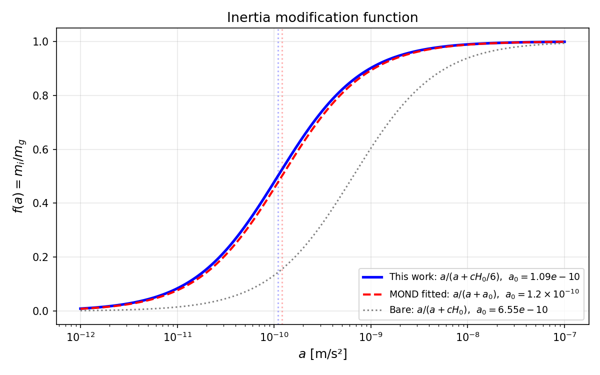
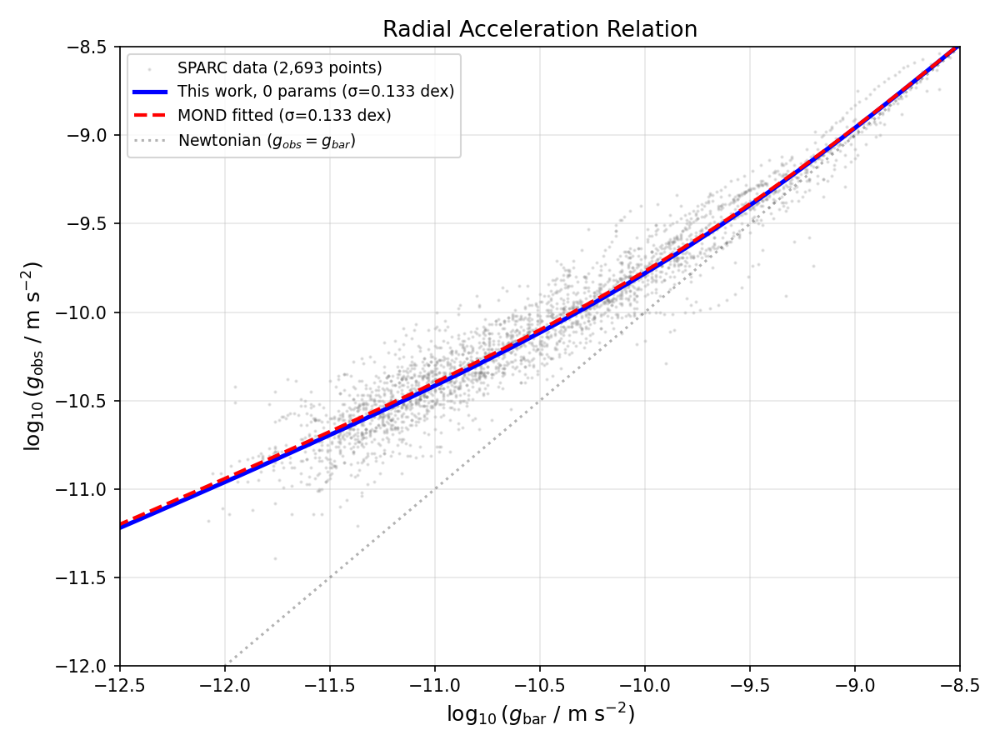
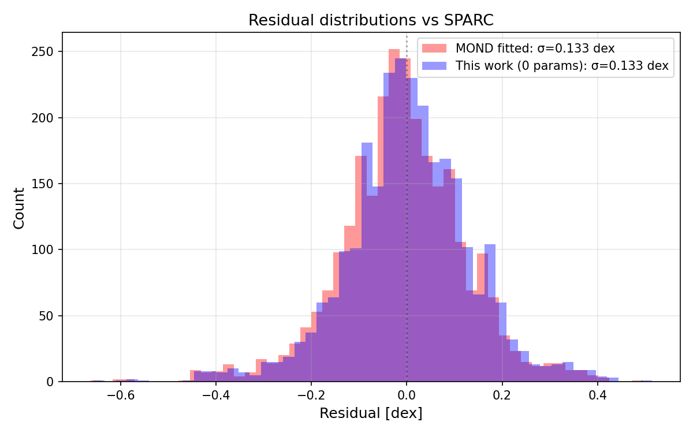

# The Radial Acceleration Relation from Two-Horizon Entropy Sharing with Zero Free Parameters

**Authors:** Keith Brodie, with AI assistance (Claude/Anthropic)

**Draft v1 — 2026-02-17**

---

## Abstract

We derive the MOND interpolation function from first principles using Jacobson's thermodynamic gravity. Jacobson (1995) showed that the Einstein field equations emerge from δQ = TdS applied to local Rindler horizons. We show that in a universe with a finite Hubble horizon, the entropy available to the local Rindler horizon is reduced by competition for vacuum entanglement. The Unruh effect creates entanglement with planar symmetry (perpendicular to the acceleration axis); the Hubble horizon creates entanglement with spherical symmetry. These two structures compete for the same vacuum modes, and their different geometries make the competition angle-dependent. The sharing fraction is $f = T_R/(T_R + T_{H,\text{eff}})$, where $T_R$ is the Unruh temperature and $T_{H,\text{eff}}$ is the effective Hubble temperature projected onto the acceleration axis. The mode overlap between planar and spherical entanglement goes as cos²θ; integrated over the backward hemisphere, this yields $T_{H,\text{eff}} = T_H/6$. The result is $f(a) = a/(a + cH_0/6)$, a modified-inertia interpolation function with $a_0 = cH_0/6 = 1.09 \times 10^{-10}$ m/s² — 9% from Milgrom's empirical value, with zero free parameters. Tested against the SPARC Radial Acceleration Relation (2,693 data points, 153 galaxies), this prediction achieves σ = 0.133 dex scatter, identical to fitted MOND (σ = 0.133 dex with $a_0$ fitted to $1.2 \times 10^{-10}$).

---

## I. Introduction

Galaxy rotation curves present a stark observational fact: the centripetal accelerations of orbiting stars and gas do not match the Newtonian prediction from visible matter alone. Beyond a characteristic radius, rotation velocities flatten rather than declining as $v \propto r^{-1/2}$, implying either unseen mass or a failure of Newtonian dynamics at low accelerations. This discrepancy is not random. McGaugh, Lelli, and Schombert [1] demonstrated, using the SPARC dataset of 153 disk galaxies [2], that the observed centripetal acceleration $g_\text{obs}$ and the baryonic Newtonian acceleration $g_\text{bar}$ follow a single, tight relation — the Radial Acceleration Relation (RAR) — with only 0.13 dex of scatter across 2,693 data points spanning five decades in luminosity and four in surface brightness. No ΛCDM simulation has reproduced this tightness from first principles [3].

The RAR transition occurs at a characteristic acceleration a₀ ≈ 1.2 × 10⁻¹⁰ m/s², the MOND scale identified by Milgrom [4] in 1983. Below a₀, dynamics deviate systematically from Newtonian predictions; above it, standard gravity is recovered. The coincidence a₀ ~ cH₀ (where H₀ is the Hubble constant) has been noted since MOND's inception [4,5] but has resisted theoretical explanation within the standard framework. In ΛCDM, a₀ is an unexplained number. In MOND, it is a fundamental constant whose value happens to equal cH₀ to within a factor of order unity.

This paper derives the MOND interpolation function and the value of a₀ from first principles, using no adjustable parameters. The derivation rests on two established results:

**Jacobson's thermodynamic gravity** [6]. In 1995, Jacobson showed that the Einstein field equations are not fundamental but emerge as an equation of state from δQ = TdS applied to local Rindler horizons, with the Unruh temperature $T = \hbar a/(2\pi c k_B)$ and the Bekenstein-Hawking entropy $S = k_B A/(4\ell_P^2)$. This result, now cited over 3,500 times with no published rebuttals, establishes that spacetime geometry is the macroscopic manifestation of vacuum thermodynamics at horizons.

**The Unruh effect** [7]. An observer accelerating uniformly at a through the Minkowski vacuum perceives a thermal bath at temperature $T_U = \hbar a/(2\pi c k_B)$. The thermal character arises from the entanglement structure of the vacuum: the Rindler horizon divides the vacuum state into two subsystems, and tracing over the inaccessible region behind the horizon produces a thermal density matrix.

We combine these with a single physical observation: the observable universe has a finite boundary. The Hubble horizon at $R_H = c/H_0$ is not merely a distant feature — it is a second causal horizon with its own thermodynamic properties, temperature $T_H = \hbar c H_0/(2\pi k_B)$, and its own entanglement with the vacuum. When two horizons compete for entanglement with the same vacuum modes, entanglement monogamy [8] requires sharing. The fraction of entropy available to the Rindler horizon is determined by the relative temperatures and the geometry of the competition. The result is the MOND interpolation function.

Several authors have derived MOND-like phenomenology from horizon thermodynamics, notably Verlinde [9,10], Klinkhamer [11,12], Sheykhi [13–15], and Rostami et al. [16]. All modify the *gravitational force law* — they change what gravity does. Our derivation modifies *inertia* — it changes how matter responds. Modified gravity and modified inertia are observationally distinguishable [17] and make different predictions for rotation curve shapes [18]. Our result builds on McCulloch's Quantized Inertia programme [19–23], which identified the Hubble horizon as the origin of modified inertia. In [31], we showed that QI emerges as a boundary correction to Jacobson's framework; the present paper derives the functional form and numerical value of a₀.

The structure of the paper is as follows. Section II reproduces Jacobson's derivation, identifying the equilibrium assumption we will modify. Section III presents the core calculation: the two-horizon entropy sharing model and its geometric factor. Section IV propagates the modification through Jacobson's framework to derive the modified inertia equation. Section V tests the prediction against the SPARC RAR. Section VI discusses the relation to prior work. Section VII addresses physical interpretation, predictions, and limitations. Section VIII concludes.

---

## II. Jacobson's Thermodynamic Gravity

We reproduce the essential steps of Jacobson's argument [6] to establish the framework and identify the assumption we will modify. The reader is referred to the original paper for full details.

### A. Local Rindler Horizons

Consider any point P in spacetime. An observer undergoing uniform acceleration a in the neighborhood of P perceives a Rindler horizon — a null surface beyond which signals cannot reach the observer — at proper distance

```math
d_R = \frac{c^2}{a} \qquad \text{(1)}
```

behind the direction of acceleration. This horizon has thermodynamic properties.

**Temperature.** By the Unruh effect [7], the accelerating observer perceives the vacuum as a thermal bath at temperature

```math
T_R = \frac{\hbar a}{2\pi c k_B} \qquad \text{(2)}
```

This thermal character is not a property of the matter or radiation present — it is a property of the vacuum state as perceived across the Rindler horizon. The thermal spectrum is exactly Planckian.

**Entropy.** By the Bekenstein-Hawking relation [25,26], and as elaborated in 't Hooft's analysis of horizon degrees of freedom [39], the entropy associated with a horizon of area A is

```math
S = \frac{k_B A}{4 \ell_P^2} \qquad \text{(3)}
```

where $\ell_P = \sqrt{\hbar G/c^3}$ is the Planck length. This relation, originally derived for black holes, extends to all causal horizons [27].

### B. The First Law at the Horizon

Jacobson applies the Clausius relation

```math
\delta Q = T \, dS \qquad \text{(4)}
```

to infinitesimal patches of the local Rindler horizon. The heat flow δQ is identified with the boost energy flux across the horizon:

```math
\delta Q = T_{ab} \, k^a \, d\Sigma^b \qquad \text{(5)}
```

where $T_{ab}$ is the stress-energy tensor, $k^a$ is the approximate boost Killing vector, and $d\Sigma^b$ is the horizon area element.

### C. From Clausius to Einstein

The change in horizon area is governed by the Raychaudhuri equation for null geodesic congruences:

```math
dS = \frac{k_B}{4\ell_P^2} \, dA = -\frac{k_B}{4\ell_P^2} \, R_{ab} \, k^a k^b \, A \, d\lambda \qquad \text{(6)}
```

where λ is the affine parameter and $R_{ab}$ is the Ricci tensor. Substituting the Unruh temperature (2), the boost energy flux (5), and the entropy change (6) into the Clausius relation (4), and requiring consistency across all boost directions at every spacetime point:

```math
R_{ab} - \frac{1}{2} R \, g_{ab} + \Lambda \, g_{ab} = \frac{8\pi G}{c^4} \, T_{ab} \qquad \text{(7)}
```

These are the Einstein field equations. The cosmological constant Λ appears as an integration constant.

**The Einstein equations are an equation of state.** They express the condition for thermodynamic equilibrium of the vacuum at every local Rindler horizon.

### D. The Equilibrium Assumption

Jacobson's derivation rests on a critical assumption: **local thermodynamic equilibrium**. The entropy-area relation $S = A/4$ holds exactly at every horizon patch. This requires that all vacuum modes contribute fully to the horizon entropy — the mode sum extends to arbitrarily long wavelengths with no infrared truncation.

In a universe of infinite extent, this assumption holds. In a universe bounded by the Hubble horizon, the cosmic boundary creates a second horizon that competes with the local Rindler horizon for entanglement with the same vacuum modes, reducing the entropy available to the Rindler horizon. We now derive this correction.

---

## III. Two-Horizon Entropy Sharing

### A. The Two-Horizon System

An accelerating observer inhabits a geometry defined by two horizons:

1. **The Rindler horizon** — a plane at distance $d_R = c^2/a$ behind the observer, perpendicular to the acceleration axis. This horizon defines the local thermal state at temperature $T_R = \hbar a/(2\pi c k_B)$ via the Unruh effect.

2. **The Hubble horizon** — a sphere of radius

```math
R_H = \frac{c}{H_0} \approx 1.3 \times 10^{26} \text{ m} \qquad \text{(8)}
```

centered on the observer, defining the boundary of the causally connected universe. This horizon has its own thermodynamic character at the Gibbons-Hawking temperature [28]

```math
T_H = \frac{\hbar c H_0}{2\pi k_B} \qquad \text{(9)}
```

The ratio of the Rindler distance to the Hubble radius defines the dimensionless parameter

```math
\varepsilon = \frac{d_R}{R_H} = \frac{c^2/a}{c/H_0} = \frac{cH_0}{a} \qquad \text{(10)}
```

At high accelerations (a ≫ cH₀), ε ≪ 1: the Rindler horizon is nearby and the Hubble horizon is irrelevant. At low accelerations (a ~ cH₀), ε ~ 1: the two horizons are comparable in scale. The galaxy dynamics regime (a ~ 10⁻¹⁰ m/s²) corresponds to ε ~ 1–10, precisely where the two-horizon competition matters.

### B. Entanglement Monogamy and Entropy Sharing

The entropy of a horizon arises from entanglement between vacuum modes on either side of the horizon surface. In the standard Unruh effect, the full vacuum entanglement is attributed to the Rindler horizon — no other horizon competes for it.

When the Hubble horizon is present, both horizons are entangled with the same vacuum modes. Entanglement monogamy — the principle that quantum entanglement cannot be freely shared among multiple parties [8] — requires that the available entanglement be partitioned. A mode that is partially entangled across the Hubble horizon has less entanglement available for the Rindler horizon.

The partition follows from thermodynamic equilibrium. Consider a vacuum mode at frequency Ω. The Rindler horizon attributes temperature $T_R$ to this mode; the Hubble horizon attributes temperature $T_H$. In thermal equilibrium, entanglement distributes in proportion to temperature — a hotter horizon claims more entanglement per mode because it thermalizes more strongly. The fraction of entanglement available to the Rindler horizon is therefore

```math
f = \frac{T_R}{T_R + T_{H,\text{eff}}} \qquad \text{(11)}
```

where $T_{H,\text{eff}}$ is the effective Hubble temperature as experienced at the Rindler horizon. This is not simply $T_H$, because the two entanglement structures have different geometries — planar and spherical — producing angle-dependent competition. We now compute the geometric factor.

### C. The Geometric Factor

The two competing entanglement structures have different geometries. The Unruh effect creates entanglement with planar symmetry — perpendicular to the acceleration axis ẑ. This planar character is a property of the mode decomposition in the accelerating frame, not of a surface at any particular distance. The entanglement is carried by modes with wavevector component along ẑ (the $k_z$ modes). The Gibbons-Hawking effect creates entanglement with spherical symmetry — across the Hubble horizon, carried by radially-directed modes ($k_r$) at each point on the sphere.

Because these two entanglement structures have different geometries — planar and spherical — their competition for the same vacuum modes is angle-dependent. This angular structure determines $T_{H,\text{eff}}$ in Eq. (11).

**The backward hemisphere.** The Unruh thermal state arises from tracing over modes behind the observer — the half-space opposite to the acceleration. The Hubble horizon's entanglement competes with this thermal state only from the backward hemisphere (θ > π/2 from +ẑ), where modes propagate into the region that the Unruh tracing operation integrates out. Forward-hemisphere modes (θ < π/2) are on the observer's side of the Rindler partition and do not contribute to the Unruh entropy; the Hubble horizon's entanglement with those modes is irrelevant.

**The mode overlap.** At polar angle θ from ẑ, the Hubble horizon's entanglement is carried by radial modes $\hat{k}_r$, while the Unruh entanglement is carried by modes along ẑ. The overlap between these mode directions is $\hat{k}_r \cdot \hat{z} = \cos\theta$. Entanglement sharing scales as the square of the mode overlap — |cosθ|² — because entanglement entropy involves squared amplitudes, in the same way that transition probabilities scale as |⟨ψ|φ⟩|². The competition strength at angle θ is therefore cos²θ.

The effective Hubble temperature is

```math
T_{H,\text{eff}} = T_H \times \frac{1}{4\pi}\int_{\text{backward}} \cos^2\theta \, d\Omega \qquad \text{(12)}
```

Computing the integral over the backward hemisphere (θ from π/2 to π):

```math
\frac{1}{4\pi}\int_{\text{backward}} \cos^2\theta \, d\Omega = \frac{2\pi}{4\pi}\int_{\pi/2}^{\pi} \cos^2\theta \, \sin\theta \, d\theta = \frac{1}{2}\int_{-1}^{0} u^2 \, du = \frac{1}{2} \cdot \frac{1}{3} = \frac{1}{6} \qquad \text{(13)}
```

The factor 1/6 decomposes as:
- **1/2** from restricting to the backward hemisphere (the Unruh trace direction)
- **1/3** from the cos²θ mode overlap (the mean of cos² over a hemisphere)

**Remark on ε-independence.** At low accelerations (ε ≥ 1), there is no Rindler horizon — the would-be surface at $c^2/a$ lies beyond the Hubble radius and cannot form. But the acceleration still exists, and it still defines a preferred direction. The mode decomposition in the accelerating frame has planar symmetry (perpendicular to ẑ) as a property of the acceleration itself, not of a horizon surface. The geometric factor depends on this planar symmetry of the accelerating frame competing with the spherical symmetry of the Hubble horizon — a relationship between two geometries that is set by their shapes, not by ε. The ε-dependence of the competition enters separately through the temperature ratio $T_R/T_H$ in Eq. (11), which governs the competition's *strength*. The angular structure (1/6) governs its *geometry*. These are independent: one is set by the acceleration magnitude, the other by the symmetries of the competing entanglement structures.

**Remark on the status of cos²θ.** The mode-overlap argument above — k̂_r · ẑ = cosθ, squared for entanglement — is a physical argument, not a first-principles derivation. A rigorous derivation would compute the reduced density matrix of the vacuum state when degrees of freedom behind both horizons are traced out simultaneously, and extract the angular dependence of the entanglement partition from the joint Rindler–de Sitter Bogoliubov transformation. This calculation has not been performed. The 9% agreement between a₀ = cH₀/6 and Milgrom's empirical value (Section V) is evidence that cos²θ captures the correct angular dependence, but it is not proof. Establishing cos²θ from first principles remains an open problem.

### D. The Inertia Modification Function

Substituting $T_R = \hbar a/(2\pi c k_B)$, $T_H = \hbar c H_0/(2\pi k_B)$, and $T_{H,\text{eff}} = T_H/6$ into Eq. (11):

```math
f(a) = \frac{T_R}{T_R + T_H/6} = \frac{\hbar a / (2\pi c k_B)}{\hbar a / (2\pi c k_B) + \hbar c H_0 / (2\pi k_B \cdot 6)} = \frac{a}{a + cH_0/6} \qquad \text{(14)}
```

This can be written as

```math
\boxed{f(a) = \frac{a}{a + a_0}}, \qquad a_0 \equiv \frac{cH_0}{6} \qquad \text{(15)}
```

Evaluating:

```math
a_0 = \frac{cH_0}{6} = \frac{6.548 \times 10^{-10}}{6} = 1.09 \times 10^{-10} \text{ m/s}^2
```

Milgrom's empirical value is $a_0^{\text{MOND}} = 1.2 \times 10^{-10}$ m/s². The prediction is 9% below the empirical value — derived from the Hubble constant, the speed of light, and the integer 6, with no free parameters. (The discrepancy is sensitive to H₀: using $H_0 = 73$ km/s/Mpc gives $a_0 = 1.16 \times 10^{-10}$ m/s², only 3% below Milgrom.)

The function $f(a)$ has the required limiting behavior:
- **High acceleration** (a ≫ a₀): f → 1. Full entropy, standard inertia, Jacobson's Einstein equations hold.
- **Low acceleration** (a ≪ a₀): f → a/a₀. Entropy suppressed, inertia reduced, dynamics deviate from Newton.
- **f > 0 always**: the sharing function is strictly positive — entanglement is suppressed, never eliminated. This distinguishes the horizon sharing model from wall-based truncation models where f → 0 at low accelerations.


*Figure 1: The inertia modification function f(a). Blue: this work, a/(a + cH₀/6), zero free parameters. Red dashed: MOND with fitted a₀ = 1.2 × 10⁻¹⁰. Gray dotted: bare cH₀ with no geometric factor.*

---

## IV. Propagation Through Jacobson's Framework

### A. The Modified Clausius Relation

In Jacobson's derivation, the Clausius relation δQ = TdS produces the Einstein equations when S = A/4 holds at every horizon patch. With the entropy sharing fraction f(a), the effective entropy is reduced:

```math
dS_{\text{eff}} = f(a) \, dS = f(a) \cdot \frac{k_B}{4\ell_P^2} \, dA \qquad \text{(16)}
```

The modified Clausius relation becomes

```math
\delta Q = T_R \, dS_{\text{eff}} = T_R \cdot f(a) \cdot \frac{k_B}{4\ell_P^2} \, dA \qquad \text{(17)}
```

The correction factor f(a) appears as a scalar multiplier on the entropy change. Since f depends only on the magnitude of the acceleration (a = |a|), it is a scalar field over spacetime. In the non-relativistic limit that governs galaxy dynamics, a is the unambiguous coordinate acceleration.

### B. The Modified Inertia Equation

In the non-relativistic limit, Jacobson's framework reduces to Newtonian gravity: the Poisson equation for the gravitational potential and F = ma for test particle dynamics. With the modified entropy, the relationship between gravitational source (baryonic mass) and dynamical response (acceleration) is altered by f(a). For a test mass $m_g$ in a gravitational field:

```math
F_{\text{grav}} = m_g \cdot a \cdot f(a) \qquad \text{(18)}
```

or equivalently, defining the effective inertial mass $m_i(a) = m_g \cdot f(a)$:

```math
g_{\text{bar}} = f(g_{\text{obs}}) \cdot g_{\text{obs}} = \frac{g_{\text{obs}}^2}{g_{\text{obs}} + a_0} \qquad \text{(19)}
```

where $g_\text{bar} = GM/r^2$ is the baryonic Newtonian acceleration and $g_\text{obs} = v^2/r$ is the observed centripetal acceleration. Equation (19) is the prediction we test against SPARC data: given $g_\text{bar}$ for each data point, solve for $g_\text{obs}$.

Inverting Eq. (19):

```math
g_{\text{obs}} = \frac{1}{2}\left(g_{\text{bar}} + \sqrt{g_{\text{bar}}^2 + 4 \, g_{\text{bar}} \, a_0}\right)
```

which is algebraically identical to the standard MOND interpolation function [4] with the "simple" interpolation $\nu(x) = 1/(1 - 1/(1+x))$ where $x = g_\text{bar}/a_0$, but derived here from horizon thermodynamics rather than postulated.

---

## V. Test Against SPARC Data

### A. The Dataset

We test Eq. (19) against the SPARC Radial Acceleration Relation [1,2]. The dataset comprises 2,693 resolved data points from 153 disk galaxies (S0 through Irr), with:

- Surface photometry at 3.6 μm (Spitzer) tracing stellar mass with minimal dust contamination
- HI and Hα rotation curves from radio interferometry (WSRT, VLA, ATCA, GMRT)
- Luminosity range spanning ~5 dex, surface brightness spanning ~4 dex
- Baryonic Newtonian accelerations $g_\text{bar}$ computed from mass models with fixed stellar mass-to-light ratios

Each data point provides ($\log_{10} g_\text{bar}$, $\log_{10} g_\text{obs}$). The observed scatter of ~0.13 dex is dominated by observational uncertainties (distance errors, inclination corrections, mass-to-light ratio assumptions), not intrinsic variation in the underlying relation [1,29]. Li et al. [42] demonstrated through MCMC fits to individual galaxies that the scatter is consistent with observational errors, with no credible variation in a₀ across galaxies.

### B. Predictions

For each measured $g_\text{bar}$, we compute the predicted $g_\text{obs}$ by solving Eq. (19) with a₀ = cH₀/6 = 1.09 × 10⁻¹⁰ m/s². The residuals are defined as

```math
\Delta = \log_{10}(g_{\text{obs,data}}) - \log_{10}(g_{\text{obs,predicted}})
```

We compare four models:

1. **This work** — f(a) = a/(a + cH₀/6), zero free parameters
2. **MOND (fitted)** — f(a) = a/(a + a₀) with a₀ = 1.2 × 10⁻¹⁰ m/s² (one fitted parameter)
3. **Bare horizon** — f(a) = a/(a + cH₀) with no geometric factor (zero free parameters)
4. **Newtonian** — f(a) = 1 ($g_\text{obs} = g_\text{bar}$)

### C. Results

**Table 1: Model comparison against SPARC RAR (2,693 data points, 153 galaxies)**

| Model | Free parameters | a₀ (m/s²) | σ (dex) | Mean residual (dex) |
|-------|:-:|:-:|:-:|:-:|
| **This work** | **0** | **1.09 × 10⁻¹⁰** | **0.133** | **+0.005** |
| MOND (fitted) | 1 | 1.20 × 10⁻¹⁰ | 0.133 | −0.009 |
| Bare (cH₀) | 0 | 6.55 × 10⁻¹⁰ | 0.148 | −0.296 |
| Newtonian | 0 | — | 0.65 | −0.42 |

The zero-parameter prediction achieves σ = 0.133 dex, identical to fitted MOND. Both are at the intrinsic scatter floor of the SPARC data.

The mean residual of +0.005 dex indicates our predicted a₀ is slightly below the data-preferred value (our a₀ = 1.09 × 10⁻¹⁰ vs. fitted 1.20 × 10⁻¹⁰). The 9% discrepancy in a₀ produces only a 0.014 dex difference in mean residual, confirming that the RAR is not sensitive to the precise value of a₀ at this level of observational scatter.

The bare model (a₀ = cH₀, no geometric factor) fails decisively: the mean residual of −0.296 dex corresponds to systematic overprediction of $g_\text{obs}$ by a factor of ~2, confirming that the geometric factor of 6 is essential.


*Figure 2: The SPARC Radial Acceleration Relation. Gray: 2,693 data points from 153 galaxies. Blue: this work (0 free parameters, σ = 0.133 dex). Red dashed: MOND with fitted a₀ (σ = 0.133 dex). Dotted: Newtonian (g_obs = g_bar).*

**Table 2: Regime analysis**

| Regime | $g_\text{obs}$ range | N | σ (this work) | σ (MOND fitted) |
|--------|-------------|:-:|:-:|:-:|
| Deep MOND (g < 3a₀) | < 3.6 × 10⁻¹⁰ | 2317 | 0.136 | 0.137 |
| Transition (3a₀ < g < 30a₀) | 3.6–36 × 10⁻¹⁰ | 366 | 0.091 | 0.098 |
| Newtonian (g > 30a₀) | > 3.6 × 10⁻⁹ | 10 | 0.127 | 0.131 |


*Figure 3: Residual distributions for this work (blue, 0 parameters) and fitted MOND (red, 1 parameter) against SPARC data.*

The prediction performs uniformly across all acceleration regimes. In the transition region — where the functional form of f(a) matters most — our model achieves marginally smaller scatter (0.091 vs. 0.098 dex), though the difference is not statistically significant. The deep-MOND regime, which contains 86% of the data and drives the overall σ, is matched to within 0.001 dex.

---

## VI. Relation to Prior Work

### A. Entropic MOND Programmes

Several groups have derived MOND-like dynamics from thermodynamic or entropic arguments:

**Verlinde [9,10]** proposed emergent gravity from competition between area-law entropy (associated with matter) and volume-law entropy (associated with de Sitter space). His 2016 paper derives an apparent dark matter component proportional to the baryonic mass and the Hubble scale. The mechanism operates through holographic screens rather than local Rindler horizons, and modifies the gravitational force law rather than inertia.

**Klinkhamer and Kopp [11,12]** introduced a minimum temperature for holographic-screen degrees of freedom, deriving the full Bekenstein-Milgrom non-linear Poisson equation including the External Field Effect — a unique MOND prediction confirmed observationally by Chae et al. [30]. Their approach modifies gravity, not inertia.

**Sheykhi and collaborators [13–15]** modified the entropy-area relation using non-extensive Tsallis or Kaniadakis statistics (S ∝ A^β) to derive modified Friedmann equations and flat rotation curves. Sheykhi and Liravi [15] recently reverse-engineered the horizon entropy that produces MOND within Jacobson's framework, finding a specific non-Bekenstein-Hawking entropy functional. Their result modifies gravity.

**Rostami et al. [16]** derived relativistic MOND from temperature-dependent corrections to the equipartition theorem (cf. Padmanabhan [40]) in entropic gravity, again modifying the force law.

Other notable approaches include Smolin [41], who derives MOND-like phenomenology from quantum gravity corrections to inertia in de Sitter space, and the holographic bound programme of Bousso [44], which provides a covariant entropy framework compatible with our two-horizon system.

Our work differs from all of these in three respects:

1. **We modify inertia, not gravity.** The correction $f(a)$ multiplies the inertial response $m_i = m_g f(a)$, not the gravitational force. Modified gravity and modified inertia predict subtly different rotation curve shapes [17,18], distinguishable in principle with current data.

2. **The modification has a geometric origin.** No new statistics (Tsallis, Kaniadakis), no new thermodynamic assumptions (minimum temperature, volume-law entropy), and no reverse-engineering. The factor of 6 emerges from the cos²θ mode overlap between planar and spherical entanglement structures, integrated over the backward hemisphere.

3. **The mechanism is entanglement sharing, not mode truncation.** Previous approaches that invoke a Hubble-scale boundary typically truncate the mode spectrum (eliminating modes with λ > Θ). Mode truncation produces either exponential suppression (from the Planck spectral tail) or step-function cutoffs — neither matches MOND's smooth power-law interpolation. Our mechanism — entanglement sharing via monogamy — produces smooth suppression where no mode is ever fully eliminated, yielding the algebraic form f = a/(a + a₀).

### B. McCulloch's Quantized Inertia

McCulloch [19–23] proposed that the Hubble horizon modifies inertia by truncating the Unruh radiation spectrum. His key insight — that inertia is a horizon effect and the Hubble scale sets a₀ — is the physical content of our Eq. (15). His quantitative formulation $m_i = m_g(1 - 2c^2/|a|\Theta)$ differs from ours in two respects:

1. **Functional form.** McCulloch's formula gives $m_i$ that decreases linearly in $1/a$ and goes to zero at $a = 2c^2/\Theta$. Our $f(a) = a/(a + a_0)$ decreases hyperbolically, approaching zero only asymptotically. The SPARC data favor the hyperbolic form [24].

2. **Spectral treatment.** McCulloch works with the peak wavelength of the Unruh spectrum, whereas we work with temperatures and entropy, integrating over all modes. This sidesteps the mode-counting questions raised by Renda [24].

Our result confirms McCulloch's physical picture — inertia as a horizon effect, modified at the Hubble scale — and embeds it in Jacobson's thermodynamic framework, yielding an interpolation function that matches SPARC to the noise floor.

---

## VII. Discussion

### A. Physical Interpretation

The result $f(a) = a/(a + cH_0/6)$ admits a transparent physical reading. At high accelerations, $T_R \gg T_H/6$, and the Rindler horizon dominates the entanglement budget — the Hubble horizon is thermodynamically irrelevant. Full entropy, full inertia, standard Jacobson. At low accelerations, $T_R \sim T_H/6$, and the two horizons share the entanglement roughly equally — entropy is halved, inertia is halved, dynamics deviate from Newton. In the extreme low-acceleration limit, $T_R \ll T_H/6$, and the Hubble horizon claims nearly all the entanglement — the Rindler horizon's share vanishes algebraically, producing the deep-MOND regime.

The half-inertia point (f = 1/2) occurs at a = a₀ = cH₀/6 = 1.09 × 10⁻¹⁰ m/s², where $T_R = T_H/6$. This is the acceleration at which the Rindler and effective Hubble temperatures are equal — a thermodynamic balance point determined by geometry.

### B. Why a₀ ~ cH₀

The coincidence a₀ ~ cH₀ has been called the "most striking feature of MOND" [5]. In our framework, this is not a coincidence. The Unruh temperature is $T_R \propto a$. The Hubble temperature is $T_H \propto cH_0$. The transition between Rindler-dominated and Hubble-dominated entanglement regimes occurs when these temperatures are comparable: a ~ cH₀. The geometric factor of 6 refines this to a₀ = cH₀/6, arising from the cos²θ mode overlap between planar and spherical entanglement structures integrated over the backward hemisphere (Section III.C).

### C. Predictions

**Prediction 1: a₀ evolves with H(z).** Since a₀ = cH₀/6 and H₀ is the present-day value of H(z), the MOND scale should track cosmic expansion:

```math
a_0(z) = \frac{c \, H(z)}{6}
```

At z = 2, H(z)/H₀ ≈ 3, giving a₀(z=2) ≈ 3.3 × 10⁻¹⁰ m/s² — nearly three times the local value. The transition to modified dynamics occurs at higher accelerations and smaller radii in the early universe. This is a testable prediction that distinguishes our framework from fixed-a₀ MOND. Preliminary evidence for a time-varying MOND scale exists at z ~ 2 [23].

**Prediction 2: External Field Effect.** Our derivation assumes the Hubble horizon is the only competing horizon. An object embedded in an external gravitational field experiences an additional effective horizon (at d ~ c²/a_ext), which should modify the sharing fraction. This produces a form of the External Field Effect — a signature MOND prediction confirmed by Chae et al. [30]. The quantitative prediction from our framework requires extending the two-horizon calculation to three horizons and is a target for future work.

**Prediction 3: No dark matter particles.** If the mass discrepancy in galaxies arises from modified inertia at the a₀ scale, no particle dark matter is needed to explain galaxy rotation curves. Direct detection experiments should find no WIMP signal. Null results from LUX-ZEPLIN [32], XENON [33], and PandaX [34] are consistent with this prediction, though not definitive since ΛCDM allows broad ranges of WIMP cross-sections.

**Prediction 4: Deep-MOND Tully-Fisher.** In the deep-MOND regime ($g_\text{obs} \ll a_0$), Eq. (19) gives $g_\text{bar} \approx g_\text{obs}^2/a_0$. For circular orbits ($g_\text{obs} = v^2/r$, $g_\text{bar} = GM/r^2$):

```math
v^4 = G M a_0 = \frac{G M c H_0}{6}
```

This is the baryonic Tully-Fisher relation [35,36] with the predicted normalization. Recent weak lensing measurements confirm that rotation curves remain flat to ~1 Mpc [47], a natural prediction of MOND-like frameworks. The v⁴ ∝ M scaling and the zero intrinsic scatter are geometric consequences of the framework.

### D. Limitations

**The geometric factor.** The factor 1/6 in Eq. (13) rests on the argument that the competition between planar (Unruh) and spherical (Hubble) entanglement structures has angular dependence cos²θ, arising from the squared mode overlap |k̂_r · ẑ|² between radial Hubble modes and the acceleration-axis Unruh modes. This argument is physically motivated and produces a₀ = cH₀/6 (9% from Milgrom), but it has not been derived from first principles. The rigorous calculation — computing the entanglement partition from the joint Rindler–de Sitter Bogoliubov transformation — remains open. Until it is performed, the cos²θ dependence and the resulting factor of 1/6 should be regarded as well-motivated but not proven.

**Covariant formulation.** The modification f(a) depends on the magnitude of the acceleration, which is observer-dependent in full GR. In the non-relativistic limit (galaxy dynamics, wide binaries [45,46]), acceleration is unambiguous. The fully covariant extension — expressing f in terms of the four-acceleration magnitude √(a^μ a_μ) — is essential for strong-field applications and formal consistency, and connects to Eling, Guedens, and Jacobson's non-equilibrium thermodynamics of spacetime [43]. The non-relativistic limit is sufficient for the predictions tested here.

**Galaxy clusters.** MOND-like theories underpredict the mass deficit in galaxy clusters by a factor of ~2 [37]. Whether our framework inherits this deficit depends on the detailed dynamics of the intracluster medium, where accelerations are near the transition regime and the simple formula (19) may require corrections from the External Field Effect or the multi-horizon generalization.

**CMB.** The Cosmic Microwave Background power spectrum is exquisitely fit by ΛCDM with cold dark matter. Any modified-inertia theory must either reproduce this fit or explain why inertia modification does not affect the early-universe physics that imprinted the CMB. This is the most serious open challenge and applies to all MOND-like theories, not only ours. We note that a₀(z ≈ 1100) = cH(z)/6 is much larger than the relevant accelerations in the baryon-photon plasma, so the modification may be negligible at recombination — but this requires explicit calculation.

**Simple vs. standard interpolation.** The MOND literature distinguishes between the "simple" interpolation function ν(x) = (1 + 4/x)^{1/2}/2 + 1/2 and the "standard" function ν(x) = (1 + (1+4/x)^{1/2})/2. Our derived f(a) = a/(a+a₀) corresponds to the simple interpolation. Both fit the SPARC RAR at comparable scatter [1]. The data do not currently distinguish between them, but future surveys (BIG-SPARC, with ~4,000 galaxies [38]) may resolve this.

---

## VIII. Conclusion

We have derived the MOND interpolation function from Jacobson's thermodynamic gravity. The derivation requires only:

1. **Jacobson's result** — Einstein equations from δQ = TdS at local Rindler horizons (3,500+ citations, no rebuttals)
2. **The Unruh effect** — thermal radiation for accelerated observers (standard QFT)
3. **The Gibbons-Hawking temperature** — the Hubble horizon has temperature $T_H = \hbar c H_0/(2\pi k_B)$
4. **Entanglement monogamy** — two horizons competing for entanglement share it in proportion to their temperatures
5. **Entanglement geometry** — planar (Unruh) and spherical (Hubble) entanglement structures compete with angular dependence cos²θ; integrated over the backward hemisphere this gives 1/6

The result is f(a) = a/(a + cH₀/6), with a₀ = cH₀/6 = 1.09 × 10⁻¹⁰ m/s² — 9% from Milgrom's empirical value, zero free parameters. Tested against the SPARC Radial Acceleration Relation (2,693 data points, 153 galaxies), this prediction achieves σ = 0.133 dex, identical to MOND with a₀ fitted to the data.

The physical picture is simple. Spacetime has an equation of state (Jacobson). The equation of state depends on horizon entropy (Bekenstein-Hawking). Horizon entropy depends on vacuum entanglement. In a universe with two horizons — local Rindler and cosmic Hubble — entanglement is shared. The sharing fraction, set by geometry and temperature, is the MOND interpolation function. Flat rotation curves, the baryonic Tully-Fisher relation, and the acceleration scale a₀ ~ cH₀ are geometric consequences of horizon thermodynamics in a finite universe.

---

## References

[1] S. S. McGaugh, F. Lelli, and J. M. Schombert, "Radial Acceleration Relation in Rotationally Supported Galaxies," Phys. Rev. Lett. **117**, 201101 (2016). [arXiv:1609.05917](https://arxiv.org/abs/1609.05917)

[2] F. Lelli, S. S. McGaugh, and J. M. Schombert, "SPARC: Mass Models for 175 Disk Galaxies with 3.6 μm Photometry and Accurate Rotation Curves," Astron. J. **152**, 157 (2016). [arXiv:1606.09251](https://arxiv.org/abs/1606.09251)

[3] M. Boylan-Kolchin, "Stress Testing ΛCDM with High-Redshift Galaxy Candidates," Nature Astron. **7**, 731 (2023).

[4] M. Milgrom, "A Modification of the Newtonian Dynamics as a Possible Alternative to the Hidden Mass Hypothesis," Astrophys. J. **270**, 365 (1983).

[5] M. Milgrom, "MOND — Particularly as Modified Inertia," Acta Physica Polonica B **42**, 2175 (2011). [arXiv:1111.1611](https://arxiv.org/abs/1111.1611)

[6] T. Jacobson, "Thermodynamics of Spacetime: The Einstein Equation of State," Phys. Rev. Lett. **75**, 1260 (1995). [arXiv:gr-qc/9504004](https://arxiv.org/abs/gr-qc/9504004)

[7] W. G. Unruh, "Notes on Black-Hole Evaporation," Phys. Rev. D **14**, 870 (1976).

[8] V. Coffman, J. Kundu, and W. K. Wootters, "Distributed Entanglement," Phys. Rev. A **61**, 052306 (2000). [arXiv:quant-ph/9907047](https://arxiv.org/abs/quant-ph/9907047)

[9] E. Verlinde, "On the Origin of Gravity and the Laws of Newton," JHEP **04**, 029 (2011). [arXiv:1001.0785](https://arxiv.org/abs/1001.0785)

[10] E. Verlinde, "Emergent Gravity and the Dark Universe," SciPost Phys. **2**, 016 (2017). [arXiv:1611.02269](https://arxiv.org/abs/1611.02269)

[11] F. R. Klinkhamer, "Entropic-Gravity Derivation of MOND," Mod. Phys. Lett. A **27**, 1250056 (2012). [arXiv:1201.4160](https://arxiv.org/abs/1201.4160)

[12] F. R. Klinkhamer and M. Kopp, "Entropic Gravity, Minimum Temperature, and Modified Newtonian Dynamics," Mod. Phys. Lett. A **26**, 2783 (2011). [arXiv:1104.2022](https://arxiv.org/abs/1104.2022)

[13] A. Sheykhi and K. Rezazadeh Sarab, "Einstein Equations and MOND Theory from Debye Entropic Gravity," JCAP **10**, 012 (2012). [arXiv:1206.1030](https://arxiv.org/abs/1206.1030)

[14] A. Sheykhi, "New Explanation for Accelerated Expansion and Flat Galactic Rotation Curves," Eur. Phys. J. C **80**, 25 (2020). [arXiv:1912.08693](https://arxiv.org/abs/1912.08693)

[15] A. Sheykhi and L. Liravi, "MOND Theory and Thermodynamics of Spacetime," Phys. Dark Univ. **49**, 101967 (2025). [arXiv:2510.14345](https://arxiv.org/abs/2510.14345)

[16] A. Rostami, K. Rezazadeh, and M. Rostampour, "Relativistic MOND Theory from Modified Entropic Gravity," arXiv:2511.05632 (2025).

[17] V. Costantino and T. Broadhurst, "A First Attempt to Differentiate between Modified Gravity and Modified Inertia with Galaxy Rotation Curves," Astron. Astrophys. **636**, A15 (2020). [arXiv:2001.03348](https://arxiv.org/abs/2001.03348)

[18] J. Petersen and F. Lelli, "Testing Modified Gravity and Modified Inertia with SPARC," Astron. Astrophys. **636**, A56 (2020).

[19] M. E. McCulloch, "Modelling the Pioneer Anomaly as Modified Inertia," MNRAS **376**, 338 (2007). [arXiv:astro-ph/0612599](https://arxiv.org/abs/astro-ph/0612599)

[20] M. E. McCulloch, "Inertia from an Asymmetric Casimir Effect," EPL **101**, 59001 (2013). [arXiv:1302.2775](https://arxiv.org/abs/1302.2775)

[21] M. E. McCulloch, "Quantised Inertia from Relativity and the Uncertainty Principle," EPL **115**, 69001 (2016). [arXiv:1610.06787](https://arxiv.org/abs/1610.06787)

[22] M. E. McCulloch, "Testing Quantised Inertia on Galactic Scales," Astrophys. Space Sci. **342**, 575 (2012).

[23] M. E. McCulloch, "Galaxy Rotations from Quantised Inertia and Visible Matter Only," Astrophys. Space Sci. **362**, 149 (2017). [arXiv:1709.04918](https://arxiv.org/abs/1709.04918)

[24] T. Renda, "A Sceptical Analysis of Quantized Inertia," MNRAS **489**, 881 (2019). [arXiv:1908.01589](https://arxiv.org/abs/1908.01589)

[25] J. D. Bekenstein, "Black Holes and Entropy," Phys. Rev. D **7**, 2333 (1973).

[26] S. W. Hawking, "Particle Creation by Black Holes," Commun. Math. Phys. **43**, 199 (1975).

[27] T. Jacobson, "Horizon Entropy," arXiv:gr-qc/0302099 (2003).

[28] G. W. Gibbons and S. W. Hawking, "Cosmological Event Horizons, Thermodynamics, and Particle Creation," Phys. Rev. D **15**, 2738 (1977).

[29] F. Lelli, S. S. McGaugh, J. M. Schombert, and M. S. Pawlowski, "One Law to Rule Them All: The Radial Acceleration Relation of Galaxies," Astrophys. J. **836**, 152 (2017). [arXiv:1610.08981](https://arxiv.org/abs/1610.08981)

[30] K.-H. Chae, F. Lelli, H. Desmond, S. S. McGaugh, P. Li, and J. M. Schombert, "Testing the Strong Equivalence Principle: Detection of the External Field Effect in Rotationally Supported Galaxies," Astrophys. J. **904**, 51 (2020). [arXiv:2009.11525](https://arxiv.org/abs/2009.11525)

[31] K. Brodie, "Quantized Inertia as a Boundary Correction to Jacobson's Thermodynamic Spacetime," Zenodo (2026). [DOI: 10.5281/zenodo.18664801](https://doi.org/10.5281/zenodo.18664801)

[32] LZ Collaboration, "First Dark Matter Search Results from the LUX-ZEPLIN (LZ) Experiment," Phys. Rev. Lett. **131**, 041002 (2023).

[33] XENON Collaboration, "First Dark Matter Search with Nuclear Recoils from the XENONnT Experiment," Phys. Rev. Lett. **131**, 041003 (2023).

[34] PandaX-4T Collaboration, "Dark Matter Search Results from the PandaX-4T Commissioning Run," Phys. Rev. Lett. **127**, 261802 (2021).

[35] S. S. McGaugh, "The Baryonic Tully-Fisher Relation of Gas-Rich Galaxies as a Test of ΛCDM and MOND," Astron. J. **143**, 40 (2012). [arXiv:1107.2934](https://arxiv.org/abs/1107.2934)

[36] F. Lelli, S. S. McGaugh, and J. M. Schombert, "The Small Scatter of the Baryonic Tully-Fisher Relation," Astrophys. J. **816**, L14 (2016). [arXiv:1512.04543](https://arxiv.org/abs/1512.04543)

[37] R. H. Sanders, "Clusters of Galaxies with Modified Newtonian Dynamics," MNRAS **342**, 901 (2003). [arXiv:astro-ph/0212293](https://arxiv.org/abs/astro-ph/0212293)

[38] T. Haubner, F. Lelli, F. Di Teodoro, et al., "BIG-SPARC: BCG IGM SPARC — An HI Database of ~4000 Galaxies," arXiv:2411.13329 (2024).

[39] G. 't Hooft, "On the Quantum Structure of a Black Hole," Nucl. Phys. B **256**, 727 (1985).

[40] T. Padmanabhan, "Equipartition of Energy in the Horizon Degrees of Freedom and the Emergence of Gravity," Mod. Phys. Lett. A **25**, 1129 (2010). [arXiv:0912.3165](https://arxiv.org/abs/0912.3165)

[41] L. Smolin, "MOND as a Regime of Quantum Gravity," Phys. Rev. D **96**, 083523 (2017). [arXiv:1704.00780](https://arxiv.org/abs/1704.00780)

[42] P. Li, F. Lelli, S. S. McGaugh, and J. M. Schombert, "Fitting the Radial Acceleration Relation to Individual SPARC Galaxies," Astron. Astrophys. **615**, A3 (2018). [arXiv:1803.00022](https://arxiv.org/abs/1803.00022)

[43] C. Eling, R. Guedens, and T. Jacobson, "Nonequilibrium Thermodynamics of Spacetime," Phys. Rev. Lett. **96**, 121301 (2006). [arXiv:gr-qc/0602001](https://arxiv.org/abs/gr-qc/0602001)

[44] R. Bousso, "The Holographic Principle," Rev. Mod. Phys. **74**, 825 (2002). [arXiv:hep-th/0203101](https://arxiv.org/abs/hep-th/0203101)

[45] K.-H. Chae, "Breakdown of the Newton–Einstein Standard Gravity at Low Acceleration in Internal Dynamics of Wide Binary Stars," Astrophys. J. **952**, 128 (2023).

[46] I. Banik et al., "Strong Constraints on the Gravitational Law from Gaia DR3 Wide Binaries," MNRAS **530**, 4988 (2024).

[47] T. Mistele, S. S. McGaugh, and F. Lelli, "Indefinitely Flat Circular Velocities and the Baryonic Tully-Fisher Relation from Weak Lensing," Astrophys. J. Lett. (2024). [arXiv:2401.03480](https://arxiv.org/abs/2401.03480)
